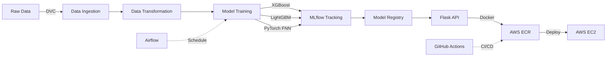

# 🚀 MLOps Production Pipeline

<div align="center">


**Enterprise-grade ML pipeline with automated training, deployment, and monitoring**

[Features](#-features) • [Architecture](#-architecture) • [Performance](#-model-performance) • [Quick Start](#-quick-start) • [Deployment](#-deployment)

</div>

---

## 📊 Model Performance

<div align="center">

| Model | AUC-ROC | Accuracy | F1-Score | Training Time |
|-------|---------|----------|----------|---------------|
| **LightGBM** | **0.97** | 94.2% | 0.93 | <30s |
| **XGBoost** | 0.96 | 93.8% | 0.92 | <30s |
| **PyTorch FNN** | 0.95 | 93.1% | 0.91 | <2min |

</div>

### 📈 ROC Curves & Confusion Matrices

All models tracked with **MLflow** including:
- ROC/AUC curves for each model
- Confusion matrices with precision/recall
- Feature importance visualizations
- Hyperparameter tuning history

---

## ✨ Features

### 🔄 **End-to-End ML Pipeline**
- **Data Versioning** with DVC for reproducible datasets
- **Experiment Tracking** with MLflow (metrics, parameters, artifacts)
- **Workflow Orchestration** with Apache Airflow for scheduled retraining
- **CI/CD Pipeline** with GitHub Actions (lint, test, build, deploy)

### 🤖 **Multiple ML Algorithms**
- **XGBoost**: Gradient boosting (50 estimators, optimized)
- **LightGBM**: Fast gradient boosting (baseline)
- **PyTorch Neural Network**: 3-layer FNN with dropout & early stopping
- **Hyperparameter Tuning**: Optuna-based optimization

### 🐳 **Production Ready**
- **Docker**: Containerized Flask application
- **AWS EC2**: Scalable compute instances
- **AWS ECR**: Private Docker registry
- **GitHub Actions**: Self-hosted runners for CI/CD

### 🎯 **Deployment**
- **Flask REST API** for real-time predictions
- **Model serving** with automatic versioning
- **Health checks** and monitoring endpoints

---

## 🏗️ Architecture



### 📦 Components

| Component | Purpose | Technology |
|-----------|---------|------------|
| **Data Pipeline** | Ingestion, validation, transformation | Pandas, Scikit-learn |
| **Model Training** | Train & evaluate ML models | XGBoost, LightGBM, PyTorch |
| **Experiment Tracking** | Log metrics, params, artifacts | MLflow 3.8.1 |
| **Orchestration** | Schedule & monitor pipelines | Apache Airflow 3.0.6 |
| **Version Control** | Track data & model versions | DVC + Git |
| **API Server** | Serve predictions via REST | Flask |
| **Containerization** | Package application | Docker |
| **Registry** | Store Docker images | AWS ECR |
| **Compute** | Host production services | AWS EC2 |
| **CI/CD** | Automated testing & deployment | GitHub Actions |

---

## 🚀 Quick Start

### Prerequisites

```bash
# Python 3.14+
python --version

# Docker installed
docker --version

# AWS CLI configured
aws --version
```

### Installation

```bash
# Clone repository
git clone https://github.com/Amit95688/ml-ops.git
cd ml-ops

# Install dependencies
pip install -r requirements.txt

# Initialize DVC
dvc pull  # Download tracked data
```

### Run Locally

#### 1️⃣ **Start MLflow UI**
```bash
python scripts/launch_mlflow_ui.py
# Access at: http://localhost:5000
```

#### 2️⃣ **Start Airflow**
```bash
AIRFLOW_HOME=$(pwd)/airflow python scripts/start_airflow.py
# Access at: http://localhost:8080
# Login: admin / YHKfeaptbhGrBCke
```

#### 3️⃣ **Train Models**
```bash
python src/pipeline/train_pipeline.py
# Results logged to MLflow automatically
```

#### 4️⃣ **Launch Flask API**
```bash
python application.py
# API running at: http://localhost:5000
```

---

## 🐳 Docker Deployment

### Build Image

```bash
docker build -t ml-ops-api:latest .
```

### Run Container

```bash
docker run -d \
  -p 5000:5000 \
  --name ml-ops-api \
  ml-ops-api:latest
```

### Push to AWS ECR

```bash
# Authenticate
aws ecr get-login-password --region us-east-1 | \
  docker login --username AWS --password-stdin <account-id>.dkr.ecr.us-east-1.amazonaws.com

# Tag
docker tag ml-ops-api:latest <account-id>.dkr.ecr.us-east-1.amazonaws.com/ml-ops-api:latest

# Push
docker push <account-id>.dkr.ecr.us-east-1.amazonaws.com/ml-ops-api:latest
```

---

## ☁️ AWS Deployment

### EC2 Setup

```bash
# SSH to EC2 instance
ssh -i key.pem ec2-user@<public-ip>

# Pull from ECR
aws ecr get-login-password --region us-east-1 | \
  docker login --username AWS --password-stdin <account-id>.dkr.ecr.us-east-1.amazonaws.com

docker pull <account-id>.dkr.ecr.us-east-1.amazonaws.com/ml-ops-api:latest

# Run on EC2
docker run -d -p 80:5000 \
  --restart always \
  --name ml-ops-api \
  <account-id>.dkr.ecr.us-east-1.amazonaws.com/ml-ops-api:latest
```

### Security Groups
- Inbound: Port 80 (HTTP), 443 (HTTPS)
- Outbound: All traffic

---

## 🔄 CI/CD Pipeline

### GitHub Actions Workflow

```yaml
name: MLOps CI/CD

on:
  push:
    branches: [main]

jobs:
  continuous-integration:
    runs-on: ubuntu-latest
    steps:
      - Lint & format check
      - Run unit tests
      - Data validation
      
  continuous-delivery:
    needs: continuous-integration
    steps:
      - Build Docker image
      - Push to AWS ECR
      
  continuous-deployment:
    needs: continuous-delivery
    runs-on: self-hosted  # AWS EC2 runner
    steps:
      - Pull latest image
      - Deploy to production
      - Health check validation
```

### Self-Hosted Runner on EC2

```bash
# Configure GitHub Actions runner on EC2
./config.sh --url https://github.com/Amit95688/ml-ops \
  --token <YOUR_TOKEN>

./run.sh
```

---

## 📊 MLflow Integration

### Tracking Server

```bash
# Start MLflow server
mlflow server \
  --backend-store-uri sqlite:///mlflow.db \
  --default-artifact-root ./mlruns \
  --host 0.0.0.0 \
  --port 5000
```

### Log Experiments

```python
import mlflow

with mlflow.start_run(run_name="XGBoost_Training"):
    mlflow.log_params({"n_estimators": 50, "max_depth": 5})
    mlflow.log_metric("auc_roc", 0.97)
    mlflow.log_artifact("confusion_matrix.png")
    mlflow.sklearn.log_model(model, "model")
```

---

## 🔧 DVC Pipeline

### Pipeline Stages

```bash
# View pipeline DAG
dvc dag

# Reproduce entire pipeline
dvc repro

# Push data to remote storage
dvc push

# Pull data from remote
dvc pull
```

### Pipeline Definition (`dvc.yaml`)

```yaml
stages:
  data_ingestion:
    cmd: python -m src.components.data_ingestion
    outs:
      - artifacts/train.csv
      - artifacts/test.csv
      
  model_trainer:
    cmd: python src/pipeline/train_pipeline.py
    deps:
      - artifacts/train.csv
    outs:
      - artifacts/model.pkl
```

---

## 🔌 API Endpoints

### Health Check
```bash
curl http://localhost:5000/health
```

### Predict
```bash
curl -X POST http://localhost:5000/predict \
  -H "Content-Type: application/json" \
  -d '{
    "features": [5.1, 3.5, 1.4, 0.2, ...]
  }'
```

**Response:**
```json
{
  "prediction": 1,
  "probability": 0.97,
  "model": "LightGBM",
  "version": "v1.2.3"
}
```

---

## 📁 Project Structure

```
ml-ops/
├── .github/
│   └── workflows/
│       └── workflow.yml          # CI/CD pipeline
├── artifacts/                    # Model artifacts & data
├── dags/
│   └── ml_training_pipeline.py  # Airflow DAG
├── src/
│   ├── components/
│   │   ├── data_ingestion.py
│   │   ├── data_transformation.py
│   │   ├── model_trainer.py
│   │   └── pytorch_model.py
│   └── pipeline/
│       ├── train_pipeline.py
│       └── predict_pipeline.py
├── scripts/
│   ├── start_airflow.py
│   └── launch_mlflow_ui.py
├── tests/                        # Unit & integration tests
├── application.py                # Flask API
├── Dockerfile                    # Container definition
├── dvc.yaml                      # DVC pipeline
├── requirements.txt              # Dependencies
└── README.md
```

---

## 🧪 Testing

```bash
# Run all tests
pytest tests/

# With coverage
pytest --cov=src tests/

# Integration tests
pytest tests/integration/
```

---

## 📈 Monitoring

### Airflow Dashboard
- **URL**: `http://localhost:8080`
- Monitor DAG runs, task status, execution logs
- Schedule automatic retraining (weekly)

### MLflow UI
- **URL**: `http://localhost:5000`
- Compare model versions
- View experiment metrics & artifacts
- Download trained models

### Application Logs
```bash
tail -f logs/app_$(date +%Y-%m-%d).log
```

---

## 🛠️ Configuration

### Environment Variables

```bash
# .env file
AWS_REGION=us-east-1
ECR_REPOSITORY=ml-ops-api
MLFLOW_TRACKING_URI=http://localhost:5000
AIRFLOW_HOME=/path/to/airflow
```

### Model Parameters

Edit `dvc.yaml` to tune hyperparameters:
```yaml
params:
  xgboost:
    n_estimators: 100
    max_depth: 7
  lightgbm:
    num_leaves: 50
```

---

## 🤝 Contributing

```bash
# Fork the repository
# Create feature branch
git checkout -b feature/amazing-feature

# Commit changes
git commit -m "Add amazing feature"

# Push to branch
git push origin feature/amazing-feature

# Open Pull Request
```

---

## 📝 License

This project is licensed under the MIT License - see [LICENSE](LICENSE) file.

---

## 👨‍💻 Author

**Amit Dubey**

[](https://github.com/Amit95688)
[](https://linkedin.com/in/amit-dubey)

---

## 🙏 Acknowledgments

- MLflow for experiment tracking
- Apache Airflow for orchestration
- DVC for data versioning
- AWS for cloud infrastructure
- GitHub Actions for CI/CD automation

---

<div align="center">

**⭐ Star this repo if you find it useful!**

Made with ❤️ for the ML community

</div>
